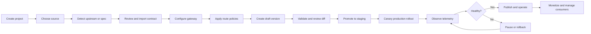

# API Build and API Management

> **Feature documentation** — The API Build entry point and the related API Management workspace used to create, configure, version, deploy, monetize, and operate one provider API. This document does not describe the complete Klyra platform.

---

## Table of Contents

1. [Overview](#overview)
2. [Feature Scope](#feature-scope)
3. [Core Concepts](#core-concepts)
4. [User Access and Permissions](#user-access-and-permissions)
5. [API Build Lifecycle](#api-build-lifecycle)
6. [Operational Sequence](#operational-sequence)
7. [Workspace and Tabs](#workspace-and-tabs)
8. [Feature Reference](#feature-reference)
9. [Properties and Configuration](#properties-and-configuration)
10. [Security and Governance](#security-and-governance)
11. [Data and Persistence](#data-and-persistence)
12. [API Service Reference](#api-service-reference)
13. [Failure Handling and System Feedback](#failure-handling-and-system-feedback)
14. [Benefits](#benefits)
15. [Future-Proofing Roadmap](#future-proofing-roadmap)
16. [Recommended Improvements](#recommended-improvements)
17. [Implementation Reference](#implementation-reference)

---

## Overview

API Build is the provider workflow for creating an API project from an existing service, GitHub repository, Docker image, or OpenAPI contract. API Management is the project workspace that appears after the API project is created.

Together, these two surfaces turn an upstream service or API specification into a governed API product. They cover the API itself and the resources directly needed to operate it; they are not a description of marketplace administration, platform billing, general repositories, or the complete Klyra system.

### API Build entry point

API Build is responsible for:

- **Existing API** — connect an already-running upstream service.
- **GitHub repository** — discover and build an API from repository source.
- **Docker image** — configure a container-backed API source.
- Project creation and initial defaults.
- Source detection and reachability checks.
- OpenAPI operation discovery and import.
- Initial gateway and environment configuration.

### API Management page

After onboarding, the provider opens one project workspace containing only the API product management areas:

- API contract and endpoint catalog
- Gateway and upstream configuration
- Route-level authentication, rate limits, mock mode, and fallback behavior
- Version lifecycle and contract diff review
- Deployment history and release operations
- Pricing plans and overage policies
- Consumers, subscriptions, quotas, and API keys
- Usage, analytics, logs, monitoring, incidents, and alert policies
- Project settings, visibility, publishing, and deletion controls

The workspace is designed around a single project record composed with related child resources. The API Build backend is the source of truth; the frontend hydrates the API Management page from the API Build service.

### Feature boundary map

| Surface | Owns | Does not own |
|---|---|---|
| **API Build** | Project creation, source selection, detection, import, and initial configuration. | General repository administration or all-purpose application deployment. |
| **API Management page** | One API project's contract, routes, versions, deployments, plans, consumers, keys, usage, analytics, logs, monitoring, and settings. | Other API projects, organization-wide administration, or unrelated platform modules. |
| **Playground integration** | Endpoint testing launched from API Management. | The complete request-builder workspace and its independent documentation. |
| **Marketplace integration** | Publishing and product visibility for the managed API. | Marketplace-wide search, reviews, payments, and settlement workflows. |

---

## Feature Scope

### What this feature enables

A provider should be able to:

1. Create an API project without manually assembling database records.
2. Detect an upstream URL or OpenAPI document through the backend proxy.
3. Import endpoint operations and schemas into a searchable catalog.
4. Apply route policies without changing the upstream application.
5. Create and review release versions using semantic versioning.
6. Promote a release through staging and production with approval gates.
7. Roll out changes gradually and recover using rollback controls.
8. Define commercial plans and customer access limits.
9. Issue, rotate, and revoke hashed API credentials.
10. Monitor reliability, traffic, latency, errors, and incidents.
11. Publish the API as a controlled API product.

### Explicit boundaries

This document does not specify the complete Klyra platform. The following areas are related integrations, not API Build or the API Management page itself:

- Global user authentication and organization administration.
- Repository management outside the API source connection.
- Marketplace-wide discovery, reviews, and unrelated listings.
- Platform-wide billing, invoices, tax, and payment settlement.
- The general Playground request-building feature, except where API Management opens it for endpoint testing.
- Infrastructure-wide monitoring outside the selected API project.
- A complete CI/CD, SIEM, data warehouse, or identity-provider replacement.

Those systems may integrate with API Management, but their complete documentation belongs in separate feature or architecture documents.

---

## Core Concepts

| Concept | Meaning |
|---|---|
| **Project** | The top-level API product, including identity, gateway settings, deployment state, plans, consumers, keys, versions, and activity. |
| **Source** | The origin used to discover or run the API: existing URL, GitHub, or Docker. |
| **Endpoint** | An imported operation with method, path, schema, authentication policy, rate limit, status, and telemetry. |
| **Version** | A semantic API contract release with status, changelog, endpoint count, traffic, and consumer impact. |
| **Deployment** | A release execution record for an environment, source, region, URL, status, logs, and author. |
| **Plan** | A commercial access tier with quota, rate limit, price, trial period, and overage price. |
| **Consumer** | A developer or organization using the API through a subscription or assigned plan. |
| **API key** | A credential associated with a consumer and plan. Plaintext is returned only at creation; storage should remain hash-only. |
| **Usage event** | An observed request used to derive volume, success, latency, error, and rate-limit metrics. |
| **Incident** | A reliability event with severity, status, affected endpoints, summary, and optional postmortem. |
| **Alert rule** | A threshold policy for latency, error rate, uptime, or rate-limit activity. |
| **Activity** | An audit-oriented project event such as project creation, version creation, plan creation, or key revocation. |

---

## User Access and Permissions

Access described here is for the API Build feature and one API Management project. It should be project-scoped and environment-aware. The roles below are the recommended enterprise model for this feature.

| Role | Typical capabilities |
|---|---|
| **Organization Owner** | Full API project control, project membership, deletion, access policies, and emergency actions. Organization billing remains outside this feature. |
| **API Administrator** | Create projects, configure gateway policies, manage versions, deployments, plans, consumers, keys, alerts, and settings. Cannot change organization billing unless granted. |
| **Release Manager** | Create versions, review diffs, manage approval gates, promote releases, configure canary rollout, and execute rollback. |
| **API Developer** | Import or edit contracts, inspect endpoints, use the Playground, create draft versions, and view operational data. Cannot promote to production by default. |
| **Support or Consumer Manager** | View consumers, manage plans and migrations, issue or revoke keys according to policy, and respond to quota or subscription issues. |
| **Observer or Auditor** | Read-only access to contracts, versions, deployments, logs, analytics, monitoring, and immutable audit history. |
| **Consumer** | Access the published API contract, use assigned credentials, view their own API usage and subscription details, and follow migration notices. |

### Permission principles

- Permissions should be scoped to an organization, project, environment, and action.
- Production promotion, key revocation, project deletion, and public publishing should require explicit permissions.
- Sensitive values must be hidden from observers and consumers who do not own them.
- Read access to logs should be separable from read access to request headers, IP addresses, and payloads.
- A user should never receive a secret after its one-time creation response has been closed.
- Emergency operators should be able to pause traffic without gaining unrestricted data access.
- Every privileged action should produce an audit event containing actor, timestamp, target, reason, and outcome.

### Recommended permission claims

A token or session can express permissions using action-oriented claims such as:

```text
api-project:read
api-project:update
api-contract:write
api-version:create
api-version:promote:staging
api-version:promote:production
api-deployment:rollback
api-consumer:manage
api-key:create
api-key:revoke
api-observability:read
api-audit:read
```

The backend must enforce these permissions. Hiding a button in the frontend is not authorization.

---

## API Build Lifecycle



### Lifecycle states

#### Project states

- `draft` — project exists but is not ready for production use.
- `deploying` — a deployment job is running or queued.
- `healthy` — gateway and upstream checks are healthy.
- `degraded` — the project is serving traffic but has reliability concerns.
- `failed` — the latest operation failed and needs intervention.
- `paused` — traffic or project operations are intentionally suspended.
- `published` — the API is available as a marketplace product.

#### Version states

The database currently supports version values such as `draft`, `published`, `deprecated`, and the UI presents operational states such as `Current`, `Beta`, `Deprecated`, and `Legacy`. These values should be normalized into a single documented enum before adding more automation.

Recommended future version states:

```text
draft -> review -> approved -> staging -> canary -> current
                                      \-> blocked
current -> deprecated -> retired
```

#### Deployment states

- `queued`
- `building`
- `deploying`
- `healthy`
- `failed`
- `paused`

---

## Operational Sequence

### 1. Create a project

The user provides a name, description, and category. The backend creates the project, assigns a slug and gateway URL, sets the initial environment to development, and creates defaults:

- Initial `v1.0.0` version.
- Free, Pro, and Business pricing plans.
- Initial project activity event.
- Default gateway and health-check properties.

### 2. Detect the source

The frontend submits a base URL or OpenAPI URL to the backend detection route. The backend performs the upstream request so browser CORS restrictions do not control discovery. The detection result can include:

- OpenAPI version.
- API title and description.
- Endpoint count.
- Schema count.
- Authentication schemes.
- Server URLs.
- Reachability and latency.
- A reason when discovery fails.

No source should be marked ready solely because a URL was entered. The system should record the actual probe result.

### 3. Import the contract

The API Build service imports operations into the endpoint catalog. Import is idempotent by project, method, and path. Existing endpoint metadata is updated while runtime telemetry fields remain owned by observed traffic.

The provider reviews:

- Methods and paths.
- Parameters and required fields.
- Request bodies and response schemas.
- Authentication requirements.
- Endpoint category and status.

### 4. Configure the gateway

The provider configures gateway behavior, including:

- Upstream base URL.
- Authentication mode and header name.
- Per-minute rate limit.
- CORS origins.
- Cache TTL.
- Retry strategy.
- Connect timeout.
- Request timeout.
- Base-path handling.
- IP allowlist.
- Health-check path.
- Environment and visibility.

Configuration changes should be validated before deployment and should produce a reviewable activity event.

### 5. Apply route policies

The provider can select one or more endpoints and stage policy changes. Route-level controls include:

- API key or bearer authentication.
- Rate limits.
- Mock mode for contract-safe responses.
- Fallback responses when upstream calls time out.
- Active, beta, or deprecated route status.

Bulk policy changes should be previewed, validated, and committed as one auditable operation. The UI supports selection and staging; durable server-side bulk operations should be added for production enforcement.

### 6. Create and review a version

A version is created as a draft or reviewable release. The provider can clone the current contract or upload a new specification, add release notes, and review a diff.

A release review should verify:

- OpenAPI or contract validity.
- Authentication compatibility.
- Breaking changes.
- Deprecated or removed routes.
- Schema compatibility.
- Consumer impact.
- Required migration guidance.
- Required approvals.

### 7. Promote through environments

Promotion should proceed from development to staging and then production. The release control plane should support:

- Approval gates.
- Canary traffic percentage.
- Automatic rollback threshold.
- Release lock during a critical change.
- Audit note or change-request reference.
- Deployment job ID and status.
- Environment-specific configuration.

The current UI provides interactive local progress feedback for these controls. The next implementation step is to persist the promotion policy and enforce it in the backend job queue.

### 8. Deploy and observe

A deployment request creates a backend job. The worker claims queued jobs, marks them running, and completes them. The workspace polls the job status and refreshes the project when the job completes.

During and after deployment, operators review:

- Deployment status and logs.
- Endpoint health.
- Success rate and error rate.
- Latency percentiles.
- Regional traffic.
- Consumer impact.
- Active incidents and alert rules.

### 9. Publish and monetize

Once a release is healthy, the provider can publish API documentation and configure marketplace visibility. Plans define commercial access, while consumer records and API keys define who can use the API.

### 10. Deprecate and migrate

A provider can schedule a sunset date, attach a migration message, inject deprecation headers, and migrate consumers gradually or immediately. Deprecation must be communicated through:

- API response headers.
- Documentation notices.
- Consumer email or notification.
- Dashboard status.
- Migration runbook.
- Final retirement date.

---

## Workspace and Tabs

The redesigned API Management workspace contains the following surfaces.

### Overview

The operational landing page. It summarizes API health, traffic, active deployment, endpoint health, insights, recent activity, and high-value actions such as redeploy, migrate, or open the Playground.

### API

The contract and endpoint catalog. It provides:

- Gateway and upstream URLs.
- OpenAPI import and synchronization.
- Endpoint search, method filters, status filters, and sorting.
- Expand/collapse endpoint details.
- Schema, parameter, request, and response inspection.
- cURL copy and Playground testing.
- Bulk route selection and governance staging.
- Route-level mock, fallback, and rate-limit controls.
- Customizable density and workspace visibility options.
- Sync progress and completion feedback.

### Deployments

The deployment control plane. It provides:

- Release history.
- Environment and status filters.
- Deployment source and region.
- Deployment logs and inspection drawer.
- Redeploy action.
- Health and edge-coverage summaries.
- Empty and filtered states.

### Versions

The contract lifecycle control plane. It provides:

- Release inventory.
- Semantic version creation.
- Contract cloning or upload.
- Release notes.
- Side-by-side diff review.
- Approval and audit-note controls.
- Staging and production promotion.
- Canary traffic percentage.
- Automatic rollback option.
- Release lock and unlock.
- Deprecation and sunset scheduling.
- Consumer migration entry point.
- One-click rollback feedback.

### Plans

The monetization control plane. It provides:

- Subscriber and MRR metrics.
- Pricing tier cards.
- Monthly request quota.
- Per-minute rate limit.
- Trial duration.
- Overage pricing.
- All, paid, and free tier views.
- New pricing tier creation.

### Consumers

The customer access control plane. It provides:

- Consumer search.
- Plan and status filters.
- Request volume and quota usage.
- Spend visibility.
- Quota-risk summary.
- Consumer detail drawer.
- Plan changes and key operations.

### API Keys

The credential control plane. It provides:

- Key generation.
- Consumer and plan assignment.
- Prefix-only display after creation.
- Search by label, consumer, or prefix.
- Active and revoked filters.
- Key rotation.
- Immediate revocation.
- Copy-prefix feedback.
- Credential inventory health summary.

### Usage

The usage reporting surface. It provides:

- Request volume.
- Success rate.
- Egress bandwidth.
- Throttled calls.
- Endpoint volume breakdown.
- Consumer volume breakdown.
- Time range selection.
- CSV or report export feedback.
- Policy posture and error-budget signals.

### Analytics

The analytical decision surface. It provides:

- Technical and business modes.
- Latency percentiles.
- Gateway request volume.
- Regional distribution.
- MRR, ARR, retention, and conversion metrics.
- Period selection.
- Previous-period comparison control.
- Auto-refresh control.
- Snapshot export.

### Logs

The request investigation surface. It provides:

- Live tail toggle.
- Query syntax for paths, status, consumers, and IDs.
- 2xx, 4xx, and 5xx filters.
- Request inspection drawer.
- Latency and error summaries.
- Export feedback.
- Empty-state recovery.

### Monitoring

The reliability and alerting surface. It provides:

- Availability history.
- Upstream health probe details.
- TLS and certificate posture.
- Incident history and postmortems.
- Incident state and severity filters.
- Alert policy list.
- Alert enable/disable control.
- Alert coverage summary.

### Settings

Project-level gateway, environment, collaboration, lifecycle, and deletion controls. Settings should be the only place for destructive project actions and should require confirmation and appropriate permission.

---

## Feature Reference

### API discovery and import

- Backend-proxied upstream detection.
- OpenAPI operation extraction.
- Reachability and latency checks.
- Idempotent endpoint import.
- Schema and security-scheme discovery.
- Import activity tracking.

### Contract governance

- Semantic versioning.
- Draft, reviewable, current, deprecated, and legacy states.
- Release notes and changelog categories: added, modified, deprecated, and breaking.
- Diff review before promotion.
- Approval gates.
- Consumer impact review.
- Deprecation headers and sunset dates.

### Runtime gateway controls

- Authentication requirement per route.
- Custom authentication header name.
- Per-route and project-level rate limits.
- Mock responses.
- Fallback responses.
- CORS policy.
- Cache policy.
- Retry strategy.
- Timeouts.
- IP allowlist.
- Health-check path.

### Progressive delivery

- Environment-aware promotion.
- Canary traffic percentage.
- Success-rate rollback threshold.
- Release lock.
- Deployment queue and job polling.
- Rollback history entry.
- Region-aware deployment records.

### Access and monetization

- Pricing plans.
- Monthly quotas.
- Per-minute limits.
- Trial periods.
- Overage prices.
- Consumer plan assignment.
- API key environment separation.
- Rotation and revocation.
- Usage and spend visibility.

### Observability

- Request logs.
- Endpoint request counts.
- Average and P95 latency.
- Error rates.
- Rate-limit events.
- Regional traffic.
- Incidents and postmortems.
- Alert rules for P95 latency, error rate, uptime, and rate limits.
- Derived usage and analytics endpoints.

---

## Properties and Configuration

### Project properties

| Property | Purpose |
|---|---|
| `name` | Human-readable API product name. |
| `slug` | Stable URL-safe project identifier. |
| `description` | Product and documentation description. |
| `category` | Marketplace and discovery classification. |
| `status` | Project lifecycle and runtime health state. |
| `environment` | Current project environment. |
| `version` | Current default contract version. |
| `sourceKind` | Existing, GitHub, or Docker source. |
| `baseUrl` | Upstream origin URL. |
| `gatewayUrl` | Klyra gateway entrypoint. |
| `authKind` | Project authentication mode. |
| `rateLimitPerMin` | Default request limit per minute. |
| `healthCheckPath` | Upstream health probe path. |
| `visibility` | Private, unlisted, or public marketplace visibility. |
| `published` | Whether the API is published. |
| `corsOrigins` | Allowed browser origins. |
| `cacheTtlSeconds` | Gateway cache duration. |
| `retryStrategy` | Upstream retry behavior. |
| `connectTimeoutMs` | Connection timeout. |
| `requestTimeoutMs` | Request timeout. |
| `stripBasePath` | Whether the gateway removes the upstream base path. |
| `authHeaderName` | Header used for credential forwarding. |
| `ipAllowlist` | Allowed source IP ranges. |
| `tags` | Search and marketplace metadata. |

### Endpoint properties

- `method`
- `path`
- `summary`
- `description`
- `category`
- `authRequired`
- `rateLimitPerMin`
- `status`
- `parameters`
- `requestBody`
- `responses`
- `mockMode`
- `fallbackEnabled`
- `fallbackResponse`
- `avgLatencyMs`
- `p95LatencyMs`
- `totalRequests`
- `errorRate`
- `isHealthy`

### Version properties

- `id`
- `semver`
- `status`
- `notes`
- `endpointsCount`
- `isDefault`
- `releasedAt`
- `changelog`
- `createdAt`

### Plan properties

- `name`
- `requestsPerMonth`
- `priceMonthly`
- `rateLimitPerMin`
- `overagePer1k`
- `trialDays`
- `subscribers`

### Key properties

- `label`
- `consumer`
- `plan`
- `environment`
- `prefix`
- `createdAt`
- `lastUsed`
- `revoked`

Secrets must not be represented by `prefix`, logs, frontend state, or documentation. The prefix is an identifier, not a credential.

---

## Security and Governance

### Authentication

- Provider dashboard users should authenticate through the platform's session or JWT flow.
- API consumers should authenticate with scoped API keys or another configured scheme.
- Upstream credentials should be stored in a secret manager, not in a project description, request log, or frontend bundle.

### Authorization

- Enforce project, environment, and action permissions in backend middleware.
- Require approval for production promotion and public publishing.
- Require confirmation for key revocation, project deletion, and immediate migration.
- Separate read access to metrics from access to sensitive request content.

### Secrets

- Generate secrets with a cryptographically secure random source.
- Hash API keys before persistence.
- Return plaintext only once at creation.
- Redact authorization headers, cookies, tokens, and secret variables in logs.
- Support key rotation with a bounded dual-write grace period.
- Maintain a revocation check that is fast enough for gateway request paths.

### Contract safety

- Validate OpenAPI documents before import.
- Detect breaking changes before promotion.
- Reject invalid semantic versions.
- Prevent publishing a version with unresolved critical validation failures.
- Require consumer migration guidance when a route or schema is removed.

### Auditability

Every privileged change should record:

- Actor ID and organization.
- Project and environment.
- Target resource and previous value.
- New value or action.
- Reason, ticket, or audit note.
- Timestamp.
- Request ID and job ID.
- Result and failure reason.

The activity feed is useful for product visibility, but enterprise audit history should be append-only, queryable, exportable, and protected from ordinary project mutation.

---

## Data and Persistence

### Backend composition model

The backend stores the project shell in `api_build_projects` and composes related records from relational tables. The project response includes:

- Project configuration.
- Endpoints.
- Plans.
- Consumers.
- API keys.
- Versions.
- Activity.
- Derived request and revenue metrics.

This composition keeps the frontend contract convenient while retaining relational ownership for mutable resources.

### Resource ownership

| Resource | Current API Build persistence boundary |
|---|---|
| Projects | `api_build_projects` JSONB project record |
| Endpoints | `api_build_endpoints` |
| Versions | `api_build_versions` |
| Plans | `api_build_plans` |
| Consumers | API Build consumer table/service |
| API keys | API Build key table/service with hash-only storage |
| Deployments | Deployment records and deployment jobs |
| Logs | API Build request log storage |
| Usage | Usage aggregation storage |
| Incidents | Incident storage |
| Alerts | Alert rule storage |
| Activity | Project activity storage |

### Consistency requirements

- Project composition must be resilient when a child resource is empty.
- Version default changes must be transactional with project current-version updates.
- Deployment job status and deployment record status must not diverge silently.
- Usage records should be idempotent or carry an event ID to prevent double counting.
- Mutations should return the persisted resource, not only an optimistic frontend projection.
- Background jobs should be retryable and expose a terminal failure reason.

---

## API Service Reference

Base path:

```text
/api/api-build
```

All responses use the project API envelope:

```json
{
  "success": true,
  "data": {}
}
```

### Projects

| Method | Route | Purpose |
|---|---|---|
| `GET` | `/projects` | List projects. |
| `POST` | `/projects` | Create a project and defaults. |
| `GET` | `/projects/:id` | Read the composed project. |
| `PUT` | `/projects/:id` | Update project configuration. |
| `DELETE` | `/projects/:id` | Remove a project. |

### Detection and endpoints

| Method | Route | Purpose |
|---|---|---|
| `POST` | `/detect` | Detect an upstream or OpenAPI document. |
| `GET` | `/projects/:id/endpoints` | List the endpoint catalog. |
| `GET` | `/projects/:id/endpoints/:eid` | Read one endpoint. |
| `PUT` | `/projects/:id/endpoints/:eid` | Update endpoint policy or metadata. |
| `POST` | `/projects/:id/endpoints/import` | Import operations from a specification or upstream. |
| `DELETE` | `/projects/:id/endpoints/:eid` | Delete an endpoint. |

### Versions

| Method | Route | Purpose |
|---|---|---|
| `GET` | `/projects/:id/versions` | List version records. |
| `POST` | `/projects/:id/versions` | Create a version. |
| `PUT` | `/projects/:id/versions/:vid` | Update version metadata or status. |
| `DELETE` | `/projects/:id/versions/:vid` | Delete a version. |

### Deployments

| Method | Route | Purpose |
|---|---|---|
| `GET` | `/projects/:id/deployments` | List deployment history. |
| `POST` | `/projects/:id/deployments` | Queue or create a deployment. |
| `PUT` | `/projects/:id/deployments/:did` | Update deployment status and logs. |
| `GET` | `/jobs/:jobId` | Read deployment job status. |

### Plans, consumers, and keys

| Method | Route | Purpose |
|---|---|---|
| `GET/POST` | `/projects/:id/plans` | List or create pricing plans. |
| `PUT/DELETE` | `/projects/:id/plans/:pid` | Update or delete a plan. |
| `GET/POST` | `/projects/:id/consumers` | List or create consumers. |
| `PUT/DELETE` | `/projects/:id/consumers/:cid` | Update or delete a consumer. |
| `GET/POST` | `/projects/:id/keys` | List or create API keys. |
| `PUT/DELETE` | `/projects/:id/keys/:kid` | Update, revoke, or delete a key. |

### Observability

| Method | Route | Purpose |
|---|---|---|
| `GET` | `/projects/:id/activity` | Read project activity. |
| `POST` | `/projects/:id/activity` | Append an activity entry. |
| `GET/POST` | `/projects/:id/logs` | Read or append request logs. |
| `GET/POST` | `/projects/:id/incidents` | Read or create incidents. |
| `PUT` | `/projects/:id/incidents/:iid` | Update incident status or postmortem. |
| `GET/POST` | `/projects/:id/alerts` | Read or create alert rules. |
| `DELETE` | `/projects/:id/alerts/:aid` | Delete an alert rule. |
| `GET` | `/projects/:id/usage` | Read usage aggregates. |
| `POST` | `/projects/:id/usage` | Record an observed usage event. |
| `GET` | `/projects/:id/analytics` | Compute analytics. |
| `GET` | `/projects/:id/insights` | Compute operational insights. |
| `POST` | `/projects/:id/health` | Run a real upstream health probe. |

---

## Failure Handling and System Feedback

The user interface should never leave a provider guessing whether an operation worked.

### Required feedback states

Every asynchronous operation should expose:

1. **Ready** — action is available.
2. **Validating** — input or contract is being checked.
3. **Queued** — a backend job exists but has not started.
4. **Running** — work is in progress with a progress indicator where possible.
5. **Succeeded** — persisted result, timestamp, and next action are visible.
6. **Partially succeeded** — successful and failed items are separated.
7. **Failed** — actionable error, request ID, retry option, and preserved input.
8. **Cancelled** — operation stopped without silently discarding user input.

### Recommended examples

- Import: show discovered count, imported count, skipped count, and conflict count.
- Sync: show contract hash before and after, changed routes, and validation result.
- Promotion: show gate checklist, job ID, traffic percentage, and rollback reason if triggered.
- Key rotation: show old-key grace expiry and new-key activation time.
- Migration: show affected consumers, completed count, failed count, and retry action.
- Alert update: show whether the policy is saved in the backend or only changed locally.

### Error response standard

Use stable error codes and safe messages:

```json
{
  "success": false,
  "error": {
    "code": "VERSION_PROMOTION_BLOCKED",
    "message": "Production promotion requires an approved change request.",
    "requestId": "req_01H...",
    "details": {
      "failedGates": ["approval"]
    }
  }
}
```

Do not expose upstream tokens, database details, stack traces, or secret values in the user-facing message.

---

## Benefits

### For API providers

- One workspace for the full API product lifecycle.
- Faster onboarding from existing services and OpenAPI documents.
- Fewer production mistakes through contract review and release gates.
- Safer rollout through canary delivery and rollback controls.
- Lower support cost through consumer, quota, key, and migration management.
- Clear monetization through configurable tiers and overage policies.
- Better reliability through telemetry, incident history, and alert rules.
- Stronger accountability through activity and audit history.

### For API consumers

- Stable versioned contracts.
- Clear documentation and migration notices.
- Predictable quotas and rate limits.
- Safer credential lifecycle.
- Better visibility into usage and subscription state.
- Fewer breaking changes reaching production without warning.

### For API management operators

- A consistent resource model across API products.
- Relational persistence for operational data.
- Queue-backed deployment execution.
- Derived metrics from observed request data.
- A clear foundation for project-scoped access, governance, and integrations.

---

## Future-Proofing Roadmap

### Priority 0: Enforce what the UI already promises

1. Persist promotion policy: canary percentage, approval requirement, audit note, rollback threshold, and release lock.
2. Enforce permissions on every API Build route using project and environment scope.
3. Move version promotion, migration, rollback, and bulk endpoint policy changes into backend jobs.
4. Return durable operation IDs and pollable status for every asynchronous action.
5. Persist UI-visible state changes instead of relying on local component state.

### Priority 1: Make releases safer

1. Add a contract compatibility engine for OpenAPI breaking-change detection.
2. Add required release gates for schema validity, security changes, test coverage, consumer impact, and incident status.
3. Add environment-specific configuration and secret references.
4. Add canary metrics windows and automatic rollback based on error rate, latency, and saturation.
5. Add deployment approvals with actor, timestamp, change request, and expiration.
6. Add immutable release manifests containing contract hash, source revision, build artifact, and configuration hash.

### Priority 2: Improve enterprise access and audit

1. Add organizations, teams, project membership, and custom roles.
2. Add SSO through OIDC/SAML and SCIM provisioning.
3. Add service accounts and short-lived workload credentials.
4. Add audit log export to SIEM or object storage.
5. Add data redaction policies by role and environment.
6. Add IP restrictions, device policy, session controls, and step-up authentication for destructive actions.

### Priority 3: Strengthen operations

1. Add OpenTelemetry traces and correlation IDs across gateway, jobs, logs, and deployments.
2. Add SLOs, error budgets, burn-rate alerts, and maintenance windows.
3. Add regional health and traffic controls.
4. Add dependency maps and upstream outage detection.
5. Add log retention, archive, deletion, and legal-hold policy.
6. Add runbooks and incident timeline collaboration.

### Priority 4: Expand product and commercial capabilities

1. Add usage-based billing and invoice reconciliation.
2. Add contract-based enterprise plans and negotiated quotas.
3. Add self-service developer portals and organization-level consumer teams.
4. Add webhooks for version releases, key events, incidents, and subscription changes.
5. Add SDK and client generation from approved contracts.
6. Add API catalog search, ownership metadata, lifecycle score, and quality score.

### Priority 5: Improve extensibility

1. Define a versioned API Build public API.
2. Publish webhooks and event schemas.
3. Add provider plugins for GitHub, GitLab, Docker registries, and cloud secret managers.
4. Add policy-as-code support using a validated declarative format.
5. Add Terraform or Pulumi resources for projects, plans, keys, alerts, and deployments.
6. Add export/import of complete API product manifests.

---

## Recommended Improvements

### 1. Normalize lifecycle enums

The backend and frontend currently use different names for some version states. Define one shared schema for project, version, deployment, incident, and key states. Generate TypeScript types and API validation from that schema.

### 2. Add backend authorization middleware

The API Build route module currently exposes the resource operations but should be mounted behind authentication and project-scoped authorization. Add authorization checks before database access and test each privileged action with allowed and denied roles.

### 3. Replace simulated UI state with operation resources

The Versions tab can display promotion progress and the Migration modal can display scheduling progress, but the backend should own those operations. Add an operation resource:

```text
POST /projects/:id/operations
GET  /projects/:id/operations/:operationId
POST /projects/:id/operations/:operationId/cancel
```

Each operation should include state, progress, actor, target, logs, errors, and result.

### 4. Add optimistic concurrency

Use a project or resource revision field. Mutations should include the revision they were based on and return a conflict when another operator has changed the resource. This prevents one release manager from silently overwriting another's policy.

### 5. Make imports fully reviewable

An import should create a proposed contract change set before mutating the live endpoint catalog. The provider should be able to accept, reject, or selectively apply route changes.

### 6. Make secrets environment-aware

Separate test and live keys, upstream secrets, and deployment secrets. Store only secret references in project configuration and resolve values at the gateway or worker boundary.

### 7. Add automated quality gates

Before promotion, run:

- OpenAPI validation.
- Breaking-change detection.
- Authentication policy checks.
- Rate-limit policy checks.
- Contract tests.
- Security scan.
- Dependency scan.
- Smoke tests against staging.
- Consumer impact analysis.

### 8. Add reliable data retention

Define retention and deletion behavior for request logs, payloads, traces, usage aggregates, audit events, and incident records. The provider should see retention status in Settings and Monitoring.

### 9. Improve accessibility and operability

- Ensure every control has a label and keyboard path.
- Announce asynchronous progress with `aria-live`.
- Preserve focus after modals close.
- Provide non-color status indicators.
- Support reduced-motion preferences.
- Keep tables usable with screen readers and narrow screens.

### 10. Add contract tests

The backend and frontend should share tests for:

- Version promotion.
- Default version changes.
- Deployment queue transitions.
- API key one-time secret behavior.
- Consumer migration.
- Alert rule validation.
- Usage aggregation and idempotency.
- Permission denial.
- Audit event creation.

---

## Implementation Reference

### Frontend

- [API Build entry](../../frontend/src/components/ApiBuildEntry.tsx)
- [API Build workspace](../../frontend/src/pages/ApiBuild/WorkspaceRedesign.tsx)
- [API Build state](../../frontend/src/pages/ApiBuild/state.ts)
- [API catalog tab](../../frontend/src/pages/ApiBuild/tabs/TabApi.tsx)
- [Deployment tab](../../frontend/src/pages/ApiBuild/tabs/TabDeployments.tsx)
- [Versions tab](../../frontend/src/pages/ApiBuild/tabs/TabVersions.tsx)
- [Plans tab](../../frontend/src/pages/ApiBuild/tabs/TabPlans.tsx)
- [Consumers tab](../../frontend/src/pages/ApiBuild/tabs/TabConsumers.tsx)
- [API keys tab](../../frontend/src/pages/ApiBuild/tabs/TabKeys.tsx)
- [Usage tab](../../frontend/src/pages/ApiBuild/tabs/TabUsage.tsx)
- [Analytics tab](../../frontend/src/pages/ApiBuild/tabs/TabAnalytics.tsx)
- [Logs tab](../../frontend/src/pages/ApiBuild/tabs/TabLogs.tsx)
- [Monitoring tab](../../frontend/src/pages/ApiBuild/tabs/TabMonitoring.tsx)
- [API Build styles](../../frontend/src/pages/ApiBuild/styles-professional.css)
- [API Build types](../../frontend/src/pages/ApiBuild/types.ts)
- [Provider project types](../../frontend/src/types/apibuild.ts)
- [API Build frontend service](../../frontend/src/services/apiBuild.ts)

### Backend

- [API Build routes](../../backend/src/modules/api-build/api-build.routes.ts)
- [API Build service](../../backend/src/modules/api-build/api-build.service.ts)
- [API Build detection](../../backend/src/modules/api-build/api-build.detect.ts)
- [API Build telemetry](../../backend/src/modules/api-build/api-build.telemetry.ts)
- [API Build queue](../../backend/src/modules/api-build/api-build.queue.ts)
- [API Build categories](../../backend/src/modules/api-build/api-build.categories.ts)

### Related documentation

- [System architecture](../architecture/system-architecture.md)
- [Database schema](../architecture/database-schema.md)
- [API design](../architecture/api-design.md)
- [Playground](./playground.md)
- [Developer setup guide](../developer/setup-guide.md)
- [Coding standards](../developer/coding-standards.md)

---

## Document Status

This document describes the current API Build implementation and the recommended enterprise roadmap. UI controls that are currently local or simulated are explicitly identified in the future-proofing sections and should not be considered backend enforcement until their state is persisted and authorized server-side.
